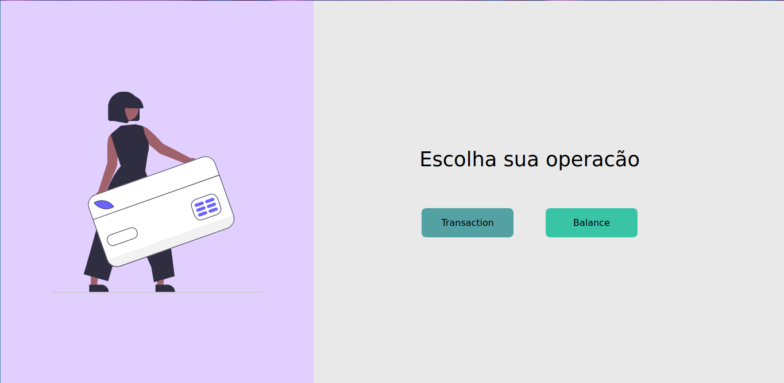

<h2 align="center">

  
   
  transaction-balance
</h2>

  <a href="#rocket-tecnologias">Tecnologias</a>&nbsp;&nbsp;&nbsp;|&nbsp;&nbsp;&nbsp;
  <a href="#-projeto">Projeto</a>&nbsp;&nbsp;&nbsp;|&nbsp;&nbsp;&nbsp;
  <a href="#-layout">Layout</a>&nbsp;&nbsp;&nbsp;|&nbsp;&nbsp;&nbsp;
  <a href="#-como-contribuir">Como contribuir</a>&nbsp;&nbsp;&nbsp;|&nbsp;&nbsp;&nbsp;
  <a href="#memo-licença">Licença</a>

 

## :rocket: Tecnologias

Esse projeto foi desenvolvido com as seguintes tecnologias:

- [Java](http://openjdk.java.net/)
- [TypeScript](www.typescriptlang.org)
- [Spring](https://spring.io/)
- [Quarkus](quarkus.io)
- [Docker](www.docker.com)
- [Kubernetes](https://kubernetes.io/)
- [PostgreeSQL](www.postgresql.org)
- [React](reactjs.org)
- [Maven](maven.apache.org)

Extras:

- Front-end
  - [NextJS](nextjs.org)

## 💻 Projeto

O **transiction-balance** é um projeto que visa demonstrar o poder de utilizar microserviços em Java, utilizando Kubernetes e Docker para gerenciamento de imagens e o benefício da performance oferecida pela utlização do Quarkus nas aplicações.

## 🤔 Como contribuir

- Faça um fork desse repositório;
- Cria uma branch com a sua feature: `git checkout -b minha-feature`;
- Faça commit das suas alterações: `git commit -m 'feat: Minha nova feature'`;
- Faça push para a sua branch: `git push origin minha-feature`.

Depois que o merge da sua pull request for feito, você pode deletar a sua branch.

## :memo: Licença

Esse projeto está sob a licença MIT. Veja o arquivo [LICENSE](LICENSE.md) para mais detalhes.

---

Feito com ❤️ by [**Elismar13**](www.github.com/Elismar13)
